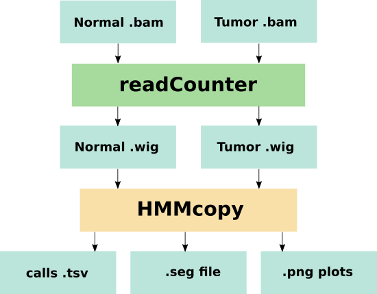

# hmmcopy

This Seqware workflow is a wrapper for [HMMcopy](https://bioconductor.org/packages/release/bioc/html/HMMcopy.html) which is a CNV analysis tool capable of making calls using paired Normal/Tumor data. The tool detects copy-number changes and allelic imbalances (including LOH) using deep-sequencing data.

Corrects GC and mappability biases for readcounts (i.e. coverage) in non-overlapping windows of fixed length for single whole genome samples, yielding a rough estimate of copy number for furthur analysis. Designed for rapid correction of high coverage whole genome tumour and normal samples.



## Cromwell

``` 
 java -jar cromwell.jar run hmmcopy.wdl --inputs inputs.json 

```

## Running Pipeline

```

 Rscript run_HMMcopy.r normal.wig tumor.wig cg_content.wig mappability.wig outputPrefix 
 
```

The workflow will take normal, tumor wig files prepared by readCounter utility as its input, and given gc content file and mappability file (both in wig format) will produce variant calls in .tsv format along with some plots. By default, data are analyzed using human hg19 reference assembly.

## Optional Assembly-specific Parameters:

hg19-specific data, for other assemblies these should be changed:

Paramter|Value
---|---

## Other Parameters with default values:

These are parameters which may be tweaked to fine tune CNV calling:

Paramter|Value
---|---

## Required Inputs:

Paramter|Value
---|---

## Outputs

```
  
```
