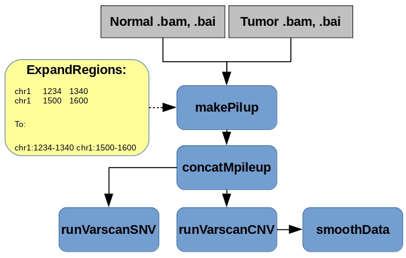

# varscan
Varscan workflow, calls Copy Number Variants and also SNVs + indels
Creation of mpileup is done with parallel processing

## Usage



## Cromwell

``` 
 java -jar cromwell.jar run varscan.wdl --inputs inputs.json 

```

## Running Pipeline

Pipeline is run as a series of steps implemented as a wdl workflow:

```
 step #1: expandRegions - service task for converting lines from .bed file to an array of strings

 step #2: makePileups - make mpileups from normal/tumor bams files for varscan

 step #3: concatMpileup - since we have multi-stream mpileup, we need to merge chunks

 step #4: runVarscanSNV - run Varscan to produce indel and SNV calls

 step #5: runVarscanCNV - run Varscan to produce CNV calls

 step #6: smoothData - additional processing (smoothing) of CNV calls

```

## Optional Parameters with default values:

Paramter|Value
---|---
bedIntervalsPath | String (optional, default = "". If not set, varscan will use chromRegions)
chromRegions | Array[String] (varscan will use this if no .bed file provided chr1:1-249250621, chr2:1-243199373 etc.)
smoothData.amp_threshold | String? (optional, default = "0")
smoothData.varScan | String? (optional, default = "$VARSCAN_ROOT/VarScan")
smoothData.modules | String? (optional, default = "varscan/2.1.12")
smoothData.del_threshold | String? (optional, default = "0")
smoothData.jobMemory | Int? (optional, default = 16)
smoothData.min_coverage | String? (optional, default = "20")
smoothData.recenter_down | String? (optional, default = "0")
smoothData.max_homdel_coverage | String? (optional, default = "5")
smoothData.recenter_up | String? (optional, default = "0")
smoothData.javaMemory | Int? (optional, default = 6)
smoothData.min_region_size | String? (optional, default = "10"),
smoothData.min_tumor_coverage | String? (optional, default = "10")
makePileups.jobMemory | Int? (optional, default = 18)
makePileups.refFasta | String? (optional, default = "$HG19_ROOT/hg19_random")
makePileups.modules | String? (optional, default = "samtools/0.1.19 hg19/p13")
makePileups.samtools | String? (optional, default = "$SAMTOOLS_ROOT/bin/samtools")
makePileups.timeout | Int (optional, default = 20)
runVarscanCNV.modules | String? (optional, default = "varscan/2.4.2 java/8")
runVarscanCNV.jobMemory | Int? (optional, default = 20)
runVarscanCNV.timeout | Int (optional, default = 20)
runVarscanCNV.varScan | String? (optional, default = "$VARSCAN_ROOT/VarScan.jar")
runVarscanCNV.javaMemory | Int? (optional, default = 6)
runVarscanCNV.logFile | String? (optional, default = "VARSCAN_CNV.log")
runVarscanCNV.pValue | Float? (optional, default = 0.05)
getSnv.minFreqForHom | Float? (optional, default = 0.75)
getSnv.minCoverageTumor | Int? (optional, default = 6)
getSnv.modules | String? (optional, default = "varscan/2.4.2 java/8")
getSnv.timeout | Int (optional, default = 20)
getSnv.minCoverageNormal | Int? (optional, default = 8)
getSnv.javaMemory | Int? (optional, default = 6)
getSnv.strandFilter | Int (optional, default = 0)
getSnv.pValue | Float? (optional, default = 0.05)
getSnv.varScan | String? (optional, default = "$VARSCAN_ROOT/VarScan.jar")
getSnv.minCoverage | Int? (optional, default = 8)
getSnv.validation | Int (optional, default = 0)
getSnv.minVarFreq | Float? (optional, default = 0
getSnv.normalPurity | Float? (optional, default = 1
getSnv.jobMemory | Int? (optional, default = 20)
getSnv.logFile | String? (optional, default = "VARSCAN_SNV
getSnv.pValueHet | Float? (optional, default = 0.99)
getSnv.tumorPurity | Float? (optional, default = 1.0)


## Required Inputs:

Paramter|Value
---|---
inputNormal | File (alignment data for normal tissue, .bam)
inputNormalIndex | File (index for normal .bam)
inputTumor | File (alignment data for tumor tissue, .bam)
inputTumorIndex | File (index for tumor .bam)
outputFileNamePrefix | String (if not set, basename of tumor input .bam file will be used)

## Outputs

```
  resultCnvFile      - copy number variants in varscan format
  
  resultSnpFile      - SNPs in native varscan format
  
  resultIndelFile    - indels in native varscan format
  
  resultSnpVcfFile   - SNV calls in .vcf format
  
  resultIndelVcfFile - indel calls in .vcf format

```
